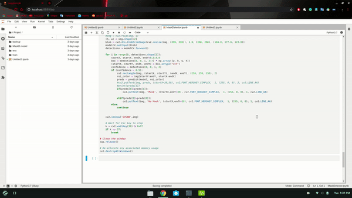

# Face-Mask-Detection

The first step will be to detect a face in the image or frame.
Once the face is detected, the region of the face will be extracted.
Then a classification model will be used to find if there is a mask or not on the face.
For classification purposes, Inception v3 will be used.

Required Models:https://drive.google.com/drive/folders/1ytJ06CV63KbBBrU2Rzik74ULTBW0JJ-_?usp=sharing

